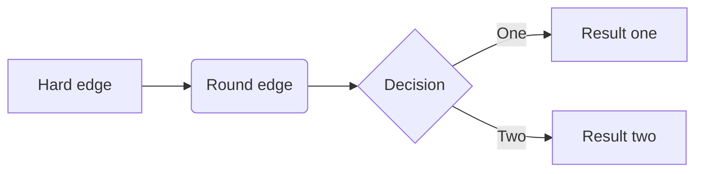

# Cookiecutter Tutorial (WIP)
This is a cookiecutter repo for demonstrating what cookiecutter is, what it can do, how to use it, and much of its functionalities.

See https://cookiecutter.readthedocs.io/en/stable/installation.html for installation.

# Table of contents  
1. [Introduction](#introduction) 
    1. [What is Cookiecutter?](#what-is-cookiecutter)
    4. [Running Cookiecutter](#running-cookiecutter)
        1. [Command line](#running-via-command-line)
        2. [Command line arguments](#command-line-arguments)
        3. [Python](#running-from-python)
        4. [Python arguments](#python-arguments)
2. [Cookiecutter in-depth](#cookiecutter-in-depth)  

# Introduction
## What is Cookiecutter?
Cookiecutter is a utility which generates "projects" from templates with the assistance of Python and Jinja2. It can be executed through the command line, or by Python through the Cookiecutter API.

Cookiecutter takes a cookiecutter directory or cookiecutter repo as its main input. Typically, the template directory is the same as the root directory of the cookiecutter. While running Cookiecutter, you'll be prompted with several variables and their default values from `cookiecutter.json`. You can type your own value in place of the default, or simply press enter without typing anything to retain the default value. Upon answering all these prompts, Cookiecutter will proceed with generating the project.

The generated project directory is a modified copy of the original template. The modifications typically involve the removal and movement of files within the original template, along with a wide range of text formatting for the names of every file along with their contents. Depending on how the template is created and what answers are given to the prompts during generation, the resulting directory can be structured and formatted in a near-infinite range of different possibilities. Cookiecutter is especially powerful for applications such as generating project directories containing all the dependencies and structuring needed as a framework for new coding projects.

**Note that "Cookiecutter" can refer to the utility itself, or to the repo/directory which is given as input. For disambiguation, I'll try to refer to the utility in uppercase as in "Cookiecutter," and the input directory in lowercase as in "cookiecutter."**


## Running Cookiecutter
### Running via command-line

Note that your chosen command line must support Unix commands in order to work.

#### If you're running on a local cookiecutter:
~~~bash  
  cookiecutter <path>
~~~

Where `<path>` is the path to the zip or root directory of your chosen cookiecutter.  

---

#### If you're running on a remote cookiecutter repo on github:
~~~bash  
  cookiecutter https://github.com/Aleyssu/cookiecutter-tutorial-example1
~~~
Or for short:
~~~bash  
  cookiecutter gh:Aleyssu/cookiecutter-tutorial-example1
~~~
You can replace the url with that of any other cookiecutter repo.  

### Command-line Arguments

If you wish to see the full list of arguments available, simply type `cookiecutter` into your command line and press enter.

#### Output directory
By default, cookiecutter outputs to the current working directory. The `-o` argument can override this behavior.
~~~bash
cookiecutter -o <output-path> <path>
~~~

#### Template directory
By default, cookiecutter assumes that the main directory is the same as the template directory. If the template is located within a subdirectory, or there are multiple templates in the given cookiecutter, the `--directory` argument will be required.
~~~bash
cookiecutter --directory <template-path> <path>
~~~

#### Reusing inputs from past executions
When generating projects, cookiecutter saves your inputs to a json file in '~/.cookiecutter_replay/'. You can re-generate a project using those same inputs using the `--replay` argument, or `--replay-file` argument if you have a custom file which you wish to replay from.
~~~bash
cookiecutter --replay <path>
~~~
~~~bash
cookiecutter --replay-file <replay-file-path> <path>
~~~

#### Skip input prompts
If you wish to use only the default configurations for your project, you can use the `--no-input` argument.
~~~bash
cookiecutter --no-input <path>
~~~

#### Load from a pre-configured config file
If you have a .yaml config file available for your cookiecutter, you can load it using the `--config-file` argument. This works alongside the `--no-input` argument.
~~~bash
cookiecutter --config-file <config-file-path> <path>
~~~

### Running from Python
Cookiecutter projects can be generated from Python using the Cookiecutter API.

First, make sure you include the Cookiecutter library with `from cookiecutter.main import cookiecutter`. 

From there, you can run Cookiecutter using the `cookiecutter('<path>')` function.

Example script (assuming that there is a cookiecutter named 'example-cookiecutter' within the same directory as the python script):
```python
from cookiecutter.main import cookiecutter

cookiecutter('example-cookiecutter')
```

### Python arguments
#### Overriding default configurations
The `extra_context` argument allows you to override the default configurations from `cookiecutter.json` and potentially inject custom-generated data from python. For example, you can inject a timestamp from python's `datetime` library:
```python
cookiecutter(
    'example-cookiecutter',
    extra_context={
        'project_name': 'Python Generated Project',
        '_timestamp': datetime.utcnow().isoformat()
    }
)
```
This function call assumes that the `cookiecutter.json` contains the variables `project_name` and `_timestamp`

#### Template Directory
By default, Cookiecutter assumes that the main directory is the same as the template directory. If the template is located within a subdirectory, or there are multiple templates in the given cookiecutter, the `directory` argument will be required.
```python
cookiecutter('example-cookiecutter', directory='template1')
```
This function call assumes that there is a cookiecutter named 'example-cookiecutter' in the same directory as the python script, and that there is a template directory located within the cookiecutter named 'template1.'

#### Skip input prompts
By default, a command line will open to prompt the user for input. To skip this and use only default values or values assigned in the `extra_context` argument, use the `no_input=True` argument.

#### Reusing inputs from past executions
When generating projects, Cookiecutter saves your inputs to a json file in '~/.cookiecutter_replay/'. You can re-generate a project using those same inputs using the `replay=true` argument.

# Cookiecutter in-depth

## Runtime
Here's a flowchart depicting the order in which Cookiecutter does things during execution:


## Templates
In a typical cookiecutter where the template directory is the root directory, the file structure would look something like this:

```
Main Directory / Repo/  
├── {{ processed_directory }}/  
│   └── # Files here will processed
├── hooks/  
│   ├── pre_gen_project.py  
│   └── post_gen_project.py  
└── cookiecutter.json  
```
### cookiecutter.json
This is a vital component of all cookiecutters. Within this file contains all the Jinja2 variables which the user is prompted with during project generation, and these are the variables which are used when formatting the text in the names and contents of the project files.

### "{{ processed_directory }}"
Note the formatting of the first sub-directory's name. This is the syntax for Jinja2 variables, and it's necessary for there to be a directory named under a variable from `cookiecutter.json` in this syntax. When executing, Cookiecutter will pick the first directory / file it finds which contains a Jinja2 variable in its name (based on lexicographical order) to copy and process into a project. 

In this example, it is assumed that there's a variable named `processsed_directory` within `cookiecutter.json`. After running Cookiecutter, a new directory will be created with the name of whatever value `processed_directory` was assigned. If `processed_directory` was assigned with "apple," then the generated project directory would also be called "apple."

Note that outside of the double curly brackets you may include whatever text you wish, so if the sub-directory was instead named "pine{{ processed_directory }}," the outputted directory would be named "pineapple" (assuming that `processed_directory` was still assigned with "apple"). A more in-depth explanation of Jinja2 can be found **!!!!!!!!!!!!!!!!!!!!!!!!!!!!!!!!!!!!!!!!!!!!!**

### Hooks


---
On the other hand, a cookiecutter where there are multiple templates or where the template directory is located within a sub-directory of the cookiecutter would look something like this:

## What does it do?

